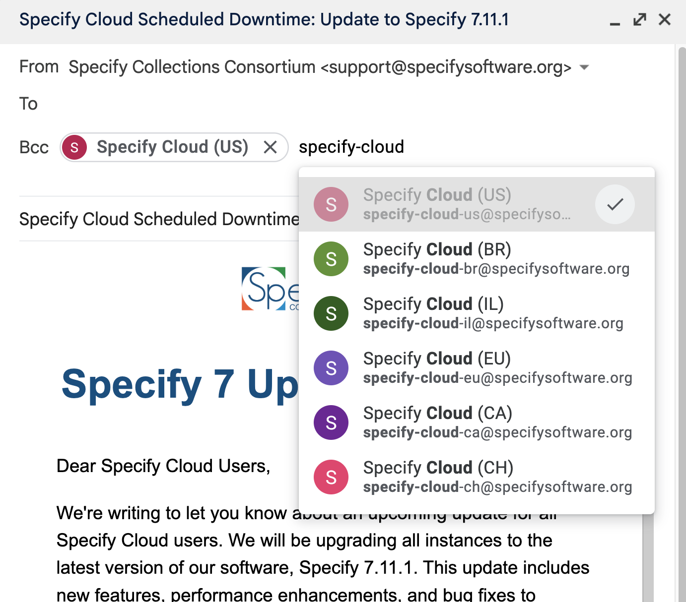

# Release Process for Hosted Users

> This assumes you are using the support@specifysoftware.org email _or_ have [delegate access](https://support.google.com/mail/answer/138350?hl=en) to the account.

After a release is ready for launch, we need to follow this process to notify users ahead of time so they can anticipate any downtime and be included on any changes taking place for their hosted instance.

## Write the Announcement

Before proceeding, make sure that the [release notes have already been written](https://specify.github.io/processes/release_notes.html) and published on the [Speciforum](https://discourse.specifysoftware.org/). These will be linked in this email.

## Send the Announcement

Draft a new email, starting in the support@specifysoftware.org inbox. In the draft, click on the **Layout** button in the bottom menu:

From here, select the "Scheduled Maintenance" layout:

Click **Edit Layout**. Once there, update the layout for this release, replacing all mentions of the Specify 7 version with the appropriate one for this release.

Don't forget to update the button link at the bottom to make it easy as possible for users to find out what changes are in the latest release.

The subject for the email should be formatted like this, replacing the Specify 7 version:
`Specify Cloud Scheduled Downtime: Update to Specify 7.11.1`

Once this is done, add all relevant [Google Groups](https://groups.google.com/) to the recipients list (in To:). For example, if this update is only for the US region of Specify Cloud, we can email `specify-cloud-us@specifysoftware.org`. If it applies to all regions, we can include these as additional recipients.

