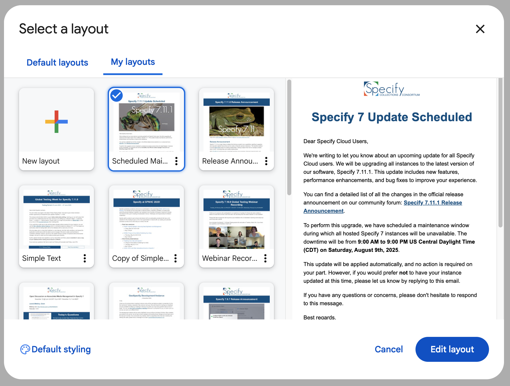
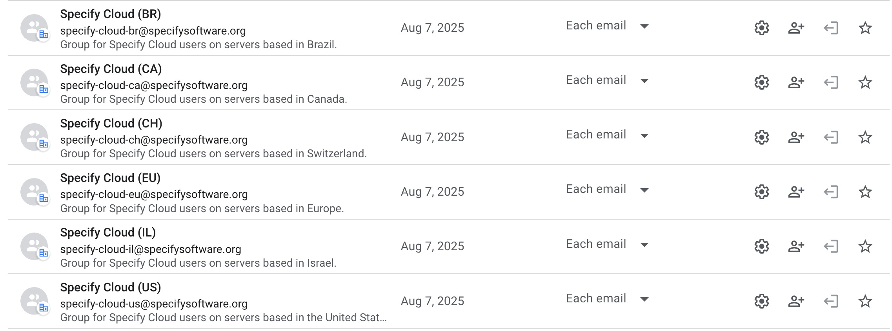

# Release Process for Hosted Users

> This assumes you are using the support@specifysoftware.org email _or_ have [delegate access](https://support.google.com/mail/answer/138350?hl=en) to the account.

After a release is ready for launch, we need to follow this process to notify users ahead of time so they can anticipate any downtime and be included on any changes taking place for their hosted instance.

## Write the Announcement

Before proceeding, make sure that the [release notes have already been written](https://specify.github.io/processes/release_notes.html) and published on the [Speciforum](https://discourse.specifysoftware.org/). These will be linked in this email.

## Send the Announcement

Draft a new email from the support@specifysoftware.org inbox (if you are not a delegate, contact the support lead or assistant). In the draft, click on the **Layout** button in the bottom menu:


From here, select the "Scheduled Maintenance" layout:



Click **Edit Layout**. Once there, update the layout for this release, replacing all mentions of the Specify 7 version with the appropriate one for this release.


It should look something like this:

> Dear Specify Cloud Users,
> 
> We're writing to let you know about an upcoming update for all Specify Cloud users. We will be upgrading all instances to the latest version of our software, Specify 7.11.1. This update includes new features, performance enhancements, and bug fixes to improve your experience.
> 
> You can find a detailed list of all the changes in the official release announcement on our community forum: Specify 7.11.1 Release Announcement.
> 
> To perform this upgrade, we have scheduled a maintenance window during which all hosted Specify 7 instances will be unavailable. The downtime will be from 9:00 AM to 9:00 PM US Central Daylight Time (CDT) on Saturday, August 9th, 2025.
> 
> This update will be applied automatically, and no action is required on your part. However, if you would prefer not to have your instance updated at this time, please let us know by replying to this email.
> 
> If you have any questions or concerns, please don't hesitate to respond to this message.
> 
> Best regards,
> 
> Specify Collections Consortium Team

Don't forget to update the button link at the bottom to make it easy as possible for users to find out what changes are in the latest release.

The subject for the email should be formatted like this, replacing the Specify 7 version:
`Specify Cloud Scheduled Downtime: Update to Specify 7.11.1`

Once this is done, add all relevant [Google Groups](https://groups.google.com/) to the recipients list (in **BCC:**, as it will hide the other regions from each other). For example, if this update is only for the US region of Specify Cloud, we can email `specify-cloud-us@specifysoftware.org`. If it applies to all regions, we can include these as additional recipients.

```
"Specify Cloud (US)" <specify-cloud-us@specifysoftware.org>, "Specify Cloud (BR)" <specify-cloud-br@specifysoftware.org>, "Specify Cloud (CA)" <specify-cloud-ca@specifysoftware.org>, "Specify Cloud (CH)" <specify-cloud-ch@specifysoftware.org>, "Specify Cloud (EU)" <specify-cloud-eu@specifysoftware.org>, "Specify Cloud (IL)" <specify-cloud-il@specifysoftware.org>
```


These are all visible in Google Groups:



After double-checking the intended recipients are set and that all links are working as expected, you can click **Send**.
