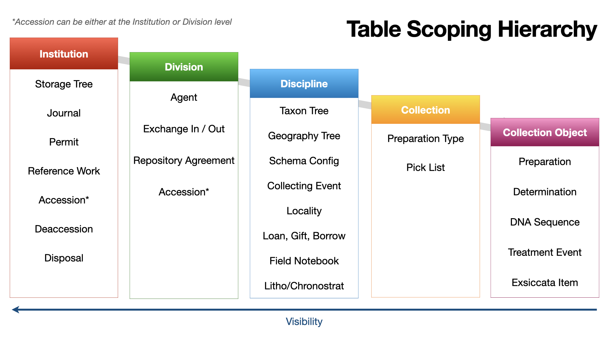

# Steps After Adding a New Institutional Scoping Level in Specify 7

_Last updated 2024-12-09_

After adding a new [institutional scoping level](https://discourse.specifysoftware.org/t/specify-institutional-scopings/1046) (collection, discipline, division) to a Specify 7 database, follow these steps:




> **WARNING:** Before following any of these steps, make sure to take a complete backup of any production database.

## Collection

_WIP_

## Discipline

### Uniqueness Rules

**Problem:** When a new discipline is added, the uniqueness rules are not automatically applied. This occurs because the migration process that creates the uniqueness rules is not already complete and does not run again.

> ⚠️ **Warning:** Make sure to note any custom uniqueness rules. If any do not match the system's defaults, carefully back them up and re-add them once these steps are complete.


**Solution:** 

1. Drop the `uniquenessrule_fields` table.
2. Drop the `uniquenessrule` table.
3. Remove the Django migration records associated with these migrations:

    ```sql
    delete from django_migrations where name IN ('0001_initial','0002_default_unique_rules');
    ```

4. Enter the container directly via command line:

    ```bash
    docker exec -it specifycloud-example-1 /bin/bash
    ```

    Inside the Docker `specify7` container, re-run the migrations:
    ```bash
    ve/bin/python manage.py migrate businessrules 0002_default_unique_rules
    ```

5. Verify that the `uniquenessrule_fields` and `uniquenessrule` tables are present. Go to the Schema Config in each discipline and verify that 'Collection Object' has a uniqueness rule for catalog number.


## Division

_WIP_

## Institution

You may only have one institution per Specify database at this time.